# lab2 gdb调试

## 一、学习理解

### 1.如何理解“使用gdb调试一下<u>正在调试ucore代码的qemu源码</u>“？

这句话我没太理解，刚开始没问大模型，它只是简单解释为”之前的实验是在‘应用层’或‘内核层’调试，而这次我们要下沉到‘硬件模拟层’ ”，我还是不太理解，所以让大模型给了我更详细易懂的解释。

我结合他的说法，理解为：就是内核层的调试就是验证我们写的C代码的逻辑对不对，有没有出错。而对qemu的调试，像是在看硬件，看这个硬件是如何具体实现我们代码要实现的功能的底层过程

然后我觉得它给的比喻很有趣，附在下面

> **一个生动的比喻：查字典**
>
> - **写 ucore (内核层)**： 你就像是在**编字典**。你负责把单词（虚拟地址）和解释（物理地址）对应起来，写在纸上，装订成册。
>   - *调试 ucore* 就是检查：有没有拼写错误？有没有把“Apple”解释成了“香蕉”？页码编对了吗？
> - **调试 QEMU (硬件层)**： 你就像是在**观察一个不懂变通的查词人**。
>   - *调试 QEMU* 就是拿着放大镜看这个查词人：
>     1. 他先翻开目录（读取 SATP）。
>     2. 他根据首字母 A 找到了第 5 页（一级页表查询）。
>     3. 他又根据第二个字母 p 翻到了第 20 页（二级页表查询）。
>     4. 最后他指着那一行说：“找到了！”（TLB 填充）。
>
> **本次实验的~~“花活”~~就在于：** 以前你只能看到“查词人”告诉你找到了还是没找到（Page Fault）。 现在你要**把时间变慢**，盯着他的手，看他每一次翻页的动作是否和你预期的一样。

### 2.硬件断点与软件断点

| **特性**         | **软件断点 (break)**                          | **硬件断点 (hbreak)**                      |
| ---------------- | --------------------------------------------- | ------------------------------------------ |
| **GDB 命令**     | `b` 或 `break`                                | `hb` 或 `hbreak`                           |
| **实现方式**     | 插入 Trap 指令 (修改代码段)                   | 使用 CPU 调试寄存器 (比较器)               |
| **对内存的要求** | **必须可写** (Writable)                       | 无要求 (可以是只读 ROM/Flash)              |
| **对页表的要求** | **必须已建立映射** (需虚拟地址能转为物理地址) | 无要求 (甚至可以在物理地址打断点)          |
| **数量限制**     | 无限制 (内存有多大就能打多少)                 | **极少** (通常只有 4~8 个)                 |
| **运行速度**     | 极快 (无额外硬件开销)                         | 极快 (硬件并行比较)                        |
| **适用场景**     | 普通应用程序、内核稳定运行后的调试            | **系统启动早期**、ROM/Flash 代码、只读内存 |

### 3.条件断点

- **定义**： 普通断点是“只要代码执行到这里，就无条件暂停”。 条件断点是“代码执行到这里时，**先计算一个布尔表达式**。如果结果为真（True），则暂停；如果为假（False），则自动继续运行，就像没发生过一样。”
- 不推荐在这个实验里用：
  - GDB 的条件断点通常是“软件实现”的。这意味着：CPU 每一次执行到 `get_physical_address` 入口，**都会被物理暂停**。
  - 后果：
  - 在这个实验中，`get_physical_address` 是一个**极其高频**的函数。
    - OS 启动过程中，可能每秒钟要进行**几万次甚至几十万次**地址翻译。
    - 如果你设置了条件断点，QEMU 就会每秒钟被暂停几十万次，GDB 忙着做判断。
    - QEMU 窗口会看起来像**死机**了一样，或者运行速度慢几千倍。原本 1 秒启动的过程，可能需要跑半个小时。

- 适用情况
  - **低频函数**：比如 `page_fault_handler`（缺页处理函数）。它不是每时每刻都在跑，只有出错时才跑。在这里设条件断点（比如 `if error_code == 5`）完全没问题。
  - **循环特定次数**：调试算法时，想看第 1000 次循环的状态。
  - **变量监控**：当某个全局变量状态异常时暂停。

## 二、调试过程

### 前置条件：

- 检查环境：
  - Ubuntu系统的gdb安装（之前的gdb调试利用的是编译工具链里面的，但它只能对ucore调试，我们想要调试qemu就得在系统里安装gdb）
  - qemu的安装编译（之前实验已完成）
  - ucore代码可以运行
- 重新编译qemu（开启调试模式）
  - 进入qemu-4.1.1的目录
    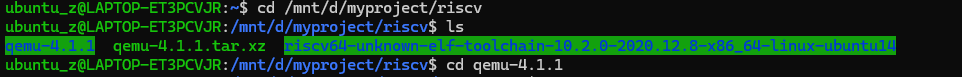
  - 清理之前的编译文件	make clean
    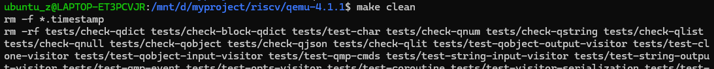
  - 重新配置，一定加上--enable-debug	
    ./configure --target-list=riscv32-softmmu,riscv64-softmmu **--enable-debug**
    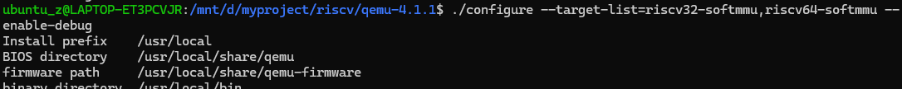
  - 重新编译	make -j$(nproc)
    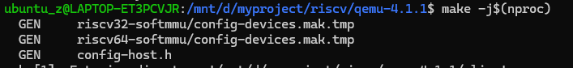
  - 这次其实不需要 sudo make install，我们可以直接运行编译出来的二进制文件，这样能确保gdb能准确找到当前目录下的源码文件。

- 修改ucore的Makefile，不修改打断点就找不到位置（分析见三）
  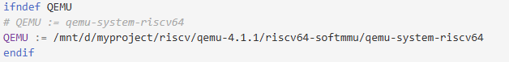

---

### 调试步骤：

#### 1.准备工作：开启三个终端窗口

打开三个 WSL 终端窗口，分别称之为 **T1**、**T2**、**T3**。

- **T1 **：用来运行 QEMU，显示 OS 的输出。（不涉及gdb）
- **T2：运行 Ubuntu 自带 GDB，用来调试 QEMU (硬件)。
- **T3：运行 RISC-V GDB，用来调试 uCore (软件)。

#### 2.启动 QEMU (在 T1 操作)

进入 uCore 项目根目录，执行：make debug

#### 3.入侵 QEMU 进程 (在 T2 操作)

进入任意目录（建议也在 uCore 目录下），执行以下步骤：

- **查找 QEMU 的进程号 (PID)**：pgrep -f qemu-system-riscv64
- **启动 GDB 并附身**：sudo gdb
  进入 `(gdb)` 界面后，输入：attach PID

- **忽略干扰信号 (关键配置)**： 为了防止 T3 连接时产生的网络信号打断调试，**必须**执行：handle SIGPIPE nostop noprint（这一步在实验册上也提及了，但是我并没问大模型，他给我的步骤中就带着这一步）
- **加载源码符号文件 (可选但推荐)**： 如果你发现看不到源码，可以显式加载 QEMU 的符号表（通常 attach 后会自动加载，这步是双保险）：file /mnt/d/myproject/riscv/qemu-4.1.1/riscv64-softmmu/qemu-system-riscv64
- **设置“硬件”断点**：break get_physical_address
- 先解决触发get_physical_address断点的小问题：(gdb) disable 1
- **让 QEMU 待命**：continue

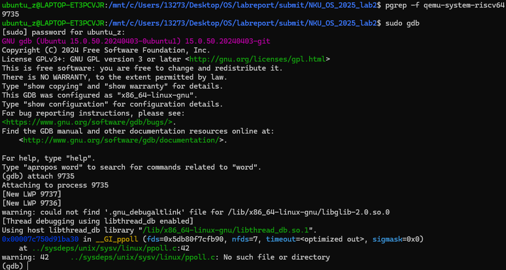

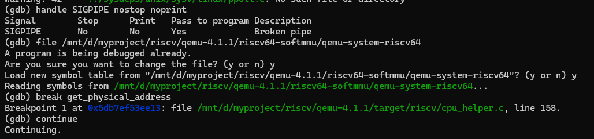

#### 4.连接并控制 uCore (在 T3 操作)

进入 **uCore 项目根目录**，执行：make gdb
这会启动 `riscv64-unknown-elf-gdb` 并自动连接到 localhost:1234。

#### 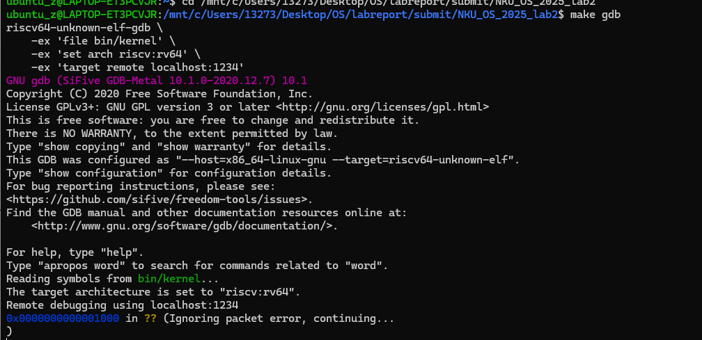

#### 5.开始联合调试

- **在 T3 让 uCore 跑到关键位置**：我们要跳过启动阶段，直接快进到操作系统启用虚拟内存的前夕。

  ```
  (gdb) break kern_init    <-- 在内核初始化函数打断点
  (gdb) continue
  ```

  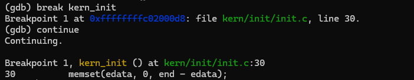

- **在 T2重新开启陷阱**：重新激活那个断点

  ```
  (gdb) Ctrl + C           <-- 先暂停正在空转的 QEMU
  (gdb) enable 1           <-- 开启 get_physical_address 断点
  (gdb) continue           <-- 让它继续
  ```

- **在 T3 触发真正的页表查询**：(gdb) si  
  T3：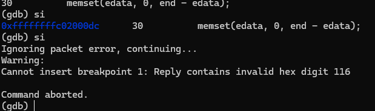
  T2：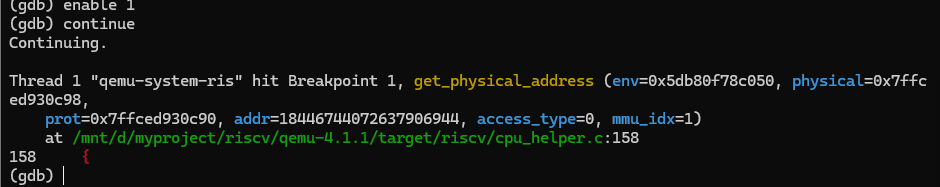

  请看 T2 的输出：hit Breakpoint 1, get_physical_address (..., addr=18446744072637906944, ...)
  这个极其巨大的数字 `18446744072637906944` 看起来很吓人，但如果你把它转成 16 进制： **它正好是 `0xFFFFFFFFC0200000`**。正是 uCore 内核的高地址段虚拟地址。
  这意味着：**成功拦截到了 uCore 在内核初始化阶段的第一次关键访存/页表查询。**

#### 6.在 T2 里开始探索

- **开启源码视图**：layout src
  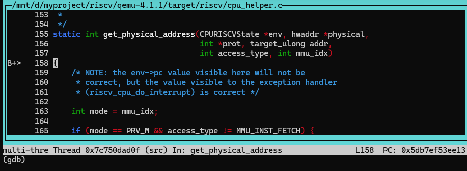
  代码停在 `cpu_helper.c` 的 `get_physical_address` 函数开头。

- **单步执行，获取satp**

  - 使用 `n` (next) 命令一行行走，直到代码执行过获取 `base` 或读取 `satp` 的行

  - 接下来(gdb) print /x env->satp
    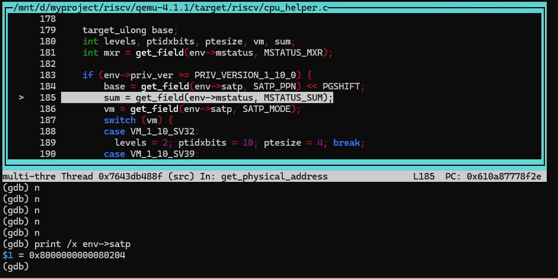

    **最高位是 8**：对应二进制 `1000...`，代表 **Mode = 8 (SV39)**。这意味着 CPU 确认要使用三级页表机制。**低位是 0x80204**：代表根页表的**物理页号 (PPN)**。
    如果你把它左移 12 位（乘以 4096），就是 **`0x80204000`**。这就是硬件马上要去读取的第一个物理地址（一级页表的位置）。

- 继续单步执行

  - 穿过配置区，停在循环入口：连续按 **`n`**，直到看到一个循环结构：
    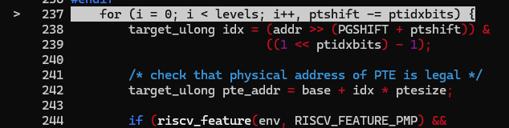

  - 当进入循环内部后，密切关注下面这两个变量的变化。用 `print` 获取：

    - **看它算出了哪个物理地址：** 找到代码里计算 `pte_addr` 的地方
      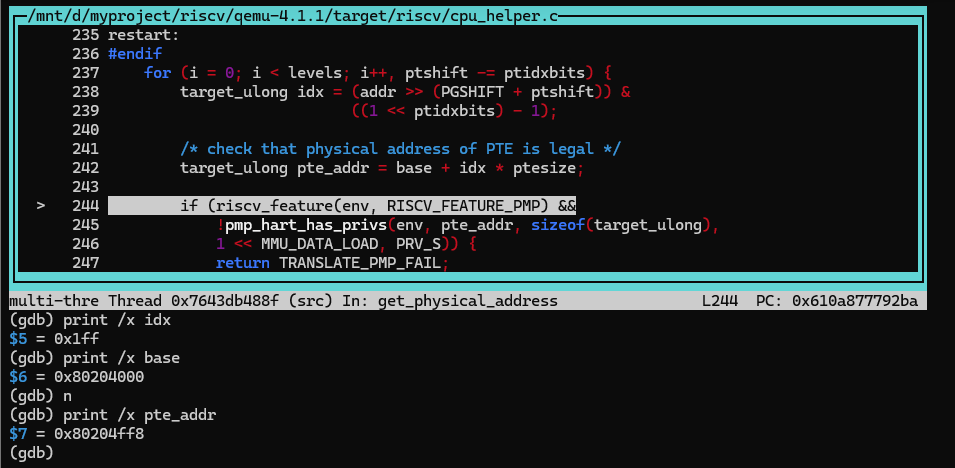

    - **看它读到了什么数据：** 找到代码里调用 `ldq_phys` (load quad physical) 的地方
      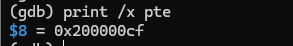

      解剖 PTE：0x200000cf——把它的低 8 位 `0xcf` 展开成二进制：`1100 1111`

      - **Bit 0 (V - Valid)**: `1`。说明这个页表项是有效的。
      - **Bit 1 (R - Read)**: `1`。
      - **Bit 2 (W - Write)**: `1`。
      - **Bit 3 (X - Execute)**: `1`。

      在 RISC-V 标准中，如果一个 PTE 的 R、W、X 位**不全为 0**，那么它就不是指向下一级页表的指针，而是一个**叶子节点（Leaf Page）**。

- 继续单步执行，循环退出后，代码会计算最终的 `*physical` 地址。 找到赋值 `*physical` 的那一行，执行完后：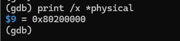

## 三、遇到的问题

- 我的大模型最开始给我的步骤是单终端调试，单 GDB 方案太“粗暴”（靠运气拦截），但其实不如实验册上的双重GDB调试策略。
  - 我分析了一下大模型为什么没给我双重GDB调试策略，主要可能有两个原因：一是我对我要达成的目标描述的不够清晰明确，导致大模型理解偏差；二是我没有告诉他我的“水平”，就是我作为专业学生，是要使用比较专业的手段的。

---

- 一开始我与大模型的交互中，大模型并没有给我“修改ucore的Makefile”的指示，但实验手册上有，本着~~好奇~~（学习）的态度，我询问了这一点，大模型作出的回应是必须那样做

  - 但是为什么他在前面的指示中没有告诉我呢？我分析应该是因为一开始的策略并不是这样，开始的策略和后面的策略不同了，但是对于后有的策略，只给出步骤，所以以后换策略的时候还要问问环境等基础内容需不需要补充或更改

  - 当然虽然知道结果会报错，我还是尝试了一下不改makefile会带来什么样的结果：
    我按照大模型给出的步骤顺利完成了attach PID，之后运行下一步break get_physical_address时就会出错：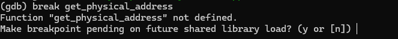
    因为正在运行的那个系统版 QEMU 里没有这些符号信息，只有调试版才有，所以为了调试我们必须修改
    ~~其实我做这个尝试也只是看看如果按大模型的步骤走（未知实验手册)，出错了能否解决而言~~

    修改后，再到break get_physical_address时就会正常显示了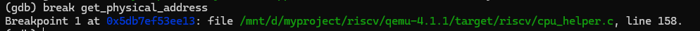

---

- make gdb启动T3时，还未continue，T2就触发断点？

  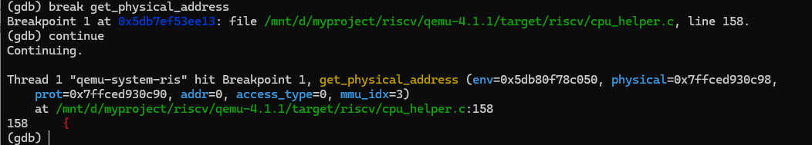

  当运行 `make gdb` 启动 T3 时，T3 的 GDB 为了显示当前停在哪里（通常会显示 `0x00001000 in ??`），它需要去**读取内存中的指令**。

  - T3 发送请求给 QEMU：“把 PC 指针处的内存读给我看看。”
  - QEMU 的 GDB Stub 收到请求，调用内存读取函数。
  - 内存读取函数为了严谨，调用了 `get_physical_address` 来确保地址合法（即使在物理寻址模式下）。
  - **砰！** T2 的断点被触发了。

  因为我们不想调试启动阶段的这些琐事，我们想看的是 uCore 建立页表后的行为。既然现在触发的是无关紧要的断点，先把它关掉，让 QEMU 跑起来。

---

- 一个神奇的问题。先上一张图片（T3）
  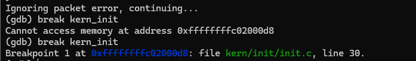

  - 同样的指令，前后我没有做任何额外的操作，只是因为时间不同结果就不一样

  - 问了大模型，出现这种情况的解析：

    - 核心原理：当输入普通 `break kern_init` 时，GDB 会尝试做一件事：
      - **动作**：去内存里找到 `kern_init` 的地址（比如 `0xffffffffc02000d8`），把那里的指令临时修改成一条特殊的陷阱指令（如 `ebreak`）。
      - **前提**：GDB 必须能**“访问”**到这个地址。

    - 根本原因在于**拦截 QEMU 的时机不同**，导致 CPU 当时的状态不同。所以就出现了这种情况。
      即第一个break时，页表还未建立，CPU不知道对应地址指向哪个物理地址，gdb打不了断点；而过了一段时间，页表建立好了就可以了。~~（原来是我打字太快）~~

  - 当然大模型也给我来一种解决方法，就是用硬件断点 (`hbreak`)
    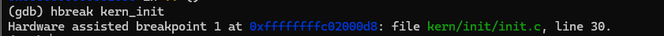

---

- 在反复调试的过程中，又出现了新的问题：T3超时断开
  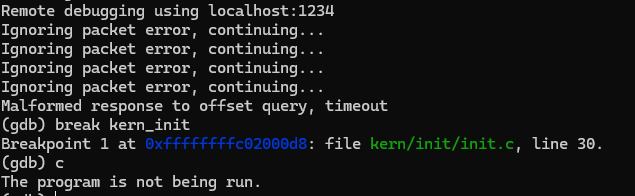

  - **案发过程重现**
    1. **T3 启动**：`Reading symbols...`。T3 试图通过网络（端口 1234）连接 QEMU。
    2. **QEMU 响应**：QEMU 刚准备回应 T3 的握手请求。
    3. **T2 介入**：与此同时，QEMU 因为响应 T3 的操作（读取内存或寄存器），触发了 T2 设置的 `get_physical_address` 断点。
    4. **灾难发生**：T2 瞬间**冻结**了 QEMU 进程。
    5. **T3 崩溃**：T3 发出的数据包石沉大海（因为 QEMU 进程挂起了，没法回复网络包）。T3 喊了几声 `Ignoring packet error`（忽略错误包），最后彻底绝望 `Timeout`（超时断开）。
    6. **后续**：当输入 `c` 时，T3 已经断开连接了，所以提示 `The program is not being run`。

  - 解决方案先 disable，后 enable：
    - T2：break get_physical_address接着禁用断点disable 1，再开T3：make gdb

---

- T3第一次si，并未触发T2断点：

  - 在 T3 里执行了 `si`，CPU 执行了一条指令。
    但是，这条指令（以及它涉及的内存页）很可能**已经在 TLB 缓存里了**。
    或者，这是一条寄存器操作指令（比如 `mv a0, a1` 准备参数），根本没有访问新的内存数据。

  - 既然 TLB 命中（Hit），或者无需访存，QEMU 就走了**快速通道**。
    它**不需要**调用 `get_physical_address` 去查页表（慢速通道）。
    因此，T2 的断点没有被触发，它继续静静地在后台监控。

  - 再次执行si后T3：
    

    T2：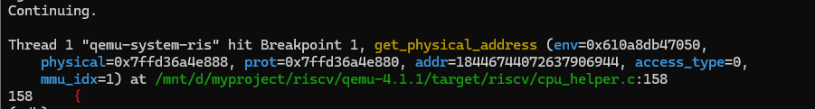

---

- 在计算physical时又出了问题，数值与大模型预测的不一致，我寻求了一下原因
  - 大模型预测0x802000d8，实际观察到是0x80200000
  - 通过输入（gdb）bt得到：
    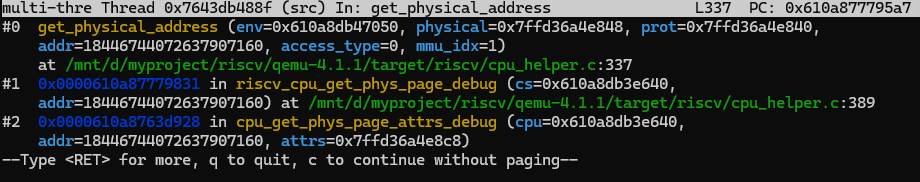
  - **谁触发了这次查表？** 不是模拟的 RISC-V CPU 因为“想要执行代码”而触发的（如果是那样，会看到 `tlb_fill`）。 而是 **GDB (T3)** 为了显示界面内容，向 QEMU 发起了“调试读取请求”。
  - **为什么地址变成了 `...000`？** `riscv_cpu_get_phys_page_debug` 这个函数通常是为了方便调试器查看内存设计的。为了提高效率或者简化逻辑，调试器在请求读取内存时，往往会按**“整页”**（Page Aligned）来查询。 GDB (T3) 想要知道这一页对应的物理地址是多少，以便它能把这一页的指令或数据读出来显示在你的屏幕上。
  - **这对实验有影响吗？** **完全没有影响！** 虽然触发源是调试器，但 **RISC-V 的查表逻辑（MMU 硬件行为）是完全共用的**。 无论谁来问，硬件都要走那套 `SATP -> Level 2 -> Physical Address` 的流程。


# lab5 gdb调试

## 一、调试思路

系统调用的本质是一次**“受控的异常（Trap）”**。

- **用户态 (User Mode)**：执行 `ecall` 指令 -> 触发异常。
- **硬件 (QEMU)**：捕获异常 -> 保存现场 -> **切换特权级 (U -> S)** -> 跳转到内核入口。
- **内核态 (Supervisor Mode)**：处理业务 -> 执行 `sret` 指令。
- **硬件 (QEMU)**：恢复现场 -> **切换特权级 (S -> U)** -> 跳转回用户程序。

我们的目标就是拦截这两个特权级切换的瞬间。

对于QEMU，在上面的实验中，拦截的是内存管理单元（MMU）的函数 `get_physical_address`。 这一次，我们需要拦截的是 **RISC-V 中断与异常处理的核心函数**`riscv_cpu_do_interrupt`。

## 二、调试过程

### 第一阶段：环境就绪与符号加载

按照标准流程启动 T1 和 T2，但在启动 T3 时需要多做一步。

- **启动 T1**
  在 uCore 根目录：make debug

- **启动 T2**
  连接 QEMU，但先不要设断点，先让它跑起来等待 T3。

  ```
  pgrep -f qemu-system-riscv64
  sudo gdb
  (gdb) attach <QEMU_PID>
  (gdb) handle SIGPIPE nostop noprint
  (gdb) c
  ```

- **启动 T3** 

  - make gdb
    连接成功后，T3 目前只知道内核 (`kernel`) 的符号信息。它不知道用户程序 `exit.c` 的代码在哪里。我们需要手动告诉它。

  - (gdb) add-symbol-file obj/__user_exit.out

    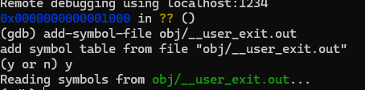
    加载成功，后续在 `exit.c` 里打断点时，GDB 就能显示出源码了。

#### 第二阶段：精准诱捕 `ecall`

我们需要让 uCore 跑过复杂的启动流程，直达用户程序 `exit.c` 调用 `fork()` 的前一刻。

- **在 T3 设置软件断点**
  我们直接在 `exit.c` 的 `fork` 调用处拦截。(gdb) break exit.c:10

  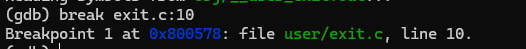
  *第 10 行是 `if ((pid = fork()) == 0) {`。如果 GDB 提示找不到源文件，可能是路径问题，可以尝试 `break main` 然后单步走到 fork。*

- **让 uCore运行**
  在T3中：

  ```
  (gdb) continue
  ```

  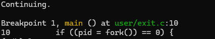
  **此时状态**：CPU 正处于 **U-Mode (用户态)**，马上就要执行 `fork()` 函数了。

- 深入汇编，直面 `ecall`
  `fork()` 是 C 库函数，它内部封装了 `ecall`。我们需要找到那条指令。 在 T3 中：

  ```
  # 查看当前及后续指令
  (gdb) x /5i $pc
  # 如果第一行（带 => 的那行）还不是 ecall，请继续输入
  (gdb) si
  (gdb) x /5i $pc
  # 直到看到输出结果的第一行变成了：=> 0x.......: ecall
  ```

  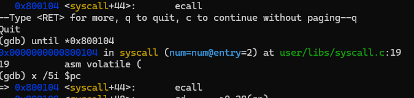
  **立刻停！** 不要执行这条 `ecall`。我们现在就停在触发系统调用的悬崖边上。

### 第三阶段：硬件层拦截 `riscv_cpu_do_interrupt`

现在 T3 已经把刀架在了 `ecall` 的脖子上，轮到 T2 出场了。

- **在 T2 设伏**
  切换到 T2 窗口，暂停 QEMU 并设置断点：
  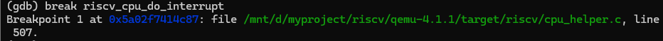

  ```
  (gdb) Ctrl+C
  (gdb) break riscv_cpu_do_interrupt
  (gdb) c
  ```

- **触发变身**
  切换回 T3 窗口，推它一把：(gdb) si
  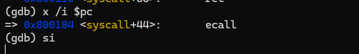

  **T2 瞬间被触发！** 显示 `Breakpoint 1, riscv_cpu_do_interrupt ...`。
  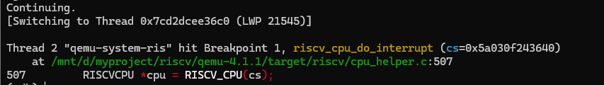

### 第四阶段：在 T2 显微镜下观察“特权级切换”

- **检查案由 (scause)**

  - RISC-V 规定，`scause` 寄存器记录异常原因。系统调用的代号是 8 (U-Mode) / 9 (S-Mode) / 11 (M-Mode)。 我们来看看是不是 `8`。

  - ```
    (gdb) print /x env->scause
    ```

  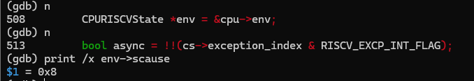

- **检查现场保存 (sepc)**

  - `sepc` 应该记录了刚才那条 `ecall` 指令的地址（或者下一条，取决于具体实现，通常是当前指令）。

  - ```
    (gdb) print /x env->pc       <-- 当前 ecall 的地址
    (gdb) print /x env->sepc     <-- 还没更新，可能还是旧值
    ```

  - 单步执行 (`n`) 几行代码，直到看到类似 `env->sepc = env->pc` 的操作后，再打印 `env->sepc`，确认它保存了用户态的 PC。
    前：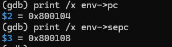后：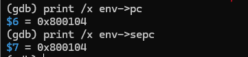

    

- **见证特权级提升 (Privilege Mode)**

  - ```
    (gdb) print env->priv
    ```

  - 继续单步 (`n`)，直到走过修改 `priv` 的代码（通常在函数末尾或者嵌套调用的 `riscv_cpu_set_mode` 里）。 再次打印上面的值
    前：后：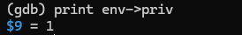

- **目标跳转**

  - 最后观察 PC 指针被修改为了内核入口（`stvec`）。
    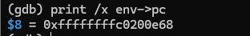

  - ```
    (gdb) print /x env->pc
    ```

### 第五阶段：观察回归 `sret`

系统调用处理完后，内核会执行 `sret` 返回用户态。我们要在 QEMU 里拦截这个返回动作。 RISC-V 的 `sret` 指令在 QEMU 中通常由辅助函数 `helper_sret` 处理。

- **在 T2 设置返回断点**

  - ```
    (gdb) break helper_sret
    (gdb) c
    ```

  - 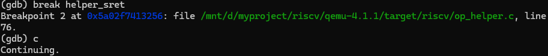

- **让 T3 继续跑**

  - 切换回 T3：

    ```
    (gdb) c
    ```

  - T3 会让 uCore 内核跑完 `do_fork` 的逻辑。当内核准备返回用户态时，T2 的断点会被触发！
    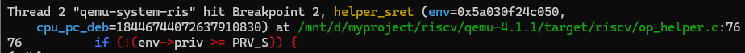

- **观察“逆向变身” (T2)**

  - 在 T2 中停在 `helper_sret` 后：
    - **特权级降级**：观察 `env->priv` 从 `1` (S) 变回 `0` (U)。
    - **PC 恢复**：观察 `env->pc` 被恢复为 `env->sepc` (即 `fork()` 之后的下一条指令)。

  前：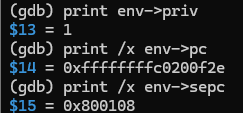
  后：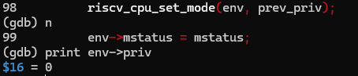

最后没能看到pc值，**不是**因为操作失败，而是因为**计算机跑得太快了**，而在 T3（软件调试器）里给的指令是“继续跑”，而不是“走一步”。
虽然没看到 `PC = 0x800108` 的数字显示，但 `[Inferior 1 ... exited normally]` 这句话本身就是最强有力的证据。且T1中也正常走完了

## 三、遇到的问题

- 在T2打断点时，遇到报错
  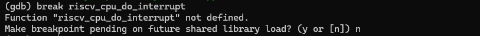

  - 原因分析：这并不是因为这个函数不存在，而是因为 QEMU 的符号表（Symbol Table）没有被正确加载，或者你的 GDB 没有找到它。

  - 解决方案：手动指定带符号的 QEMU 可执行文件

    ```
    # 假设你的源码在 /home/user/qemu-4.1.1/
    # 请替换为你实际的路径，指向那个“原味”的 qemu-system-riscv64
    sudo gdb /path/to/your/compiled/qemu-system-riscv64
    ```

  - 后面我回想起来，其实是makefile中的qemu路径没改~~（好记性）~~
    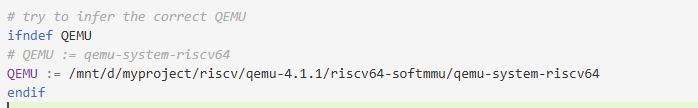

- 还未执行到相应代码就打印
  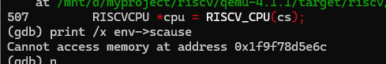
  - 一定要执行完相应变量的代码再打印

## 四、学习理解

### 一、 入口：`riscv_cpu_do_interrupt`

**（位于 `target/riscv/cpu_helper.c`）**

这个函数是 QEMU 处理所有“意外情况”（中断、异常、系统调用）的总入口。当 TCG 发现 `ecall` 指令时，它会暂停执行流，呼叫这个 C 函数来处理后事。

#### 关键流程解析：

1. **判断原因（Who are you?）**
   - 代码会读取 `cause` 变量（对应 `scause`）。
   - **你的实验**：看到了 `scause = 8`。
   - **逻辑**：QEMU 判断：“哦，是用户态（User）喊我（ecall），这属于同步异常。”
2. **保存现场（Save Game）**
   - **源码逻辑**：`env->sepc = env->pc;`
   - **你的实验**：看到 `sepc` 被更新为 `0x800104`（ecall 的地址）。
   - **解读**：这是为了将来能回得来。就像玩游戏进 Boss 房前存个档。
3. **计算去向（Where to go?）**
   - **源码逻辑**：`env->pc = (env->stvec >> 2 << 2) ...`
   - **你的实验**：你看到 `pc` 变成了 `0xffffffffc0200e68`（内核入口）。
   - **解读**：硬件读取 `stvec` 寄存器，决定把 CPU 踢到哪里去处理这个异常。
4. **特权级切换（Power Up!）** —— **最关键的一步**
   - **源码逻辑**：`riscv_cpu_set_mode(env, PRV_S);`
   - **你的实验**：看到 `priv` 从 0 变成了 1。
   - **解读**：QEMU 修改了 CPU 的状态位，从此 CPU 获得了访问内核内存和执行特权指令的能力。

------

### 二、 出口：`helper_sret`

**（位于 `target/riscv/op_helper.c`）**

这个函数是 `sret` 指令的 C 语言实现。当内核处理完业务，想把控制权还给用户时，会执行这条指令。

#### 关键流程解析：

1. **权限检查（Security Check）**
   - **源码逻辑**：`if (!(env->priv >= PRV_S)) { ... }`
   - **解读**：只有管理员（内核）才有资格决定何时释放权力。如果用户态程序偷偷执行 `sret`，这里会直接报错（抛出非法指令异常）。
2. **读取存档（Load Game）**
   - **源码逻辑**：
     - 读取 `mstatus` 中的 `SPP` 位（Previous Privilege，之前的特权级）。
     - 读取 `sepc`（之前存的返回地址）。
   - **你的实验**：你看到 `sepc` 是 `0x800108`（`ecall` 的下一条指令）。
3. **特权级降级（Power Down）**
   - **源码逻辑**：`riscv_cpu_set_mode(env, prev_priv);`
   - **你的实验**：你看到 `priv` 从 1 变回了 0。
   - **解读**：这是“辞官归隐”。CPU 交出特权，变回普通用户模式。
4. **返回目标（Jump Back）**
   - **源码逻辑**：`return retpc;`
   - **解读**：函数返回了 `sepc` 的值。TCG 引擎拿到这个返回值后，会将下一条要执行的指令指针（PC）强行修改为这个地址。

------

### 三、 什么是 TCG Translation？（关键概念）

在调试中一直有个疑问：**为什么单步调试汇编指令时，大部分指令（如 `add`, `lw`）不会触发 T2 的断点，只有 `ecall` 和 `sret` 会触发？**

这就是 QEMU 的黑科技 —— **TCG (Tiny Code Generator)**。

1. **翻译（Translation）**： QEMU 不会傻傻地解释执行每一条 RISC-V 指令。它会把一段 RISC-V 指令（比如一个基本块）**“翻译”**成宿主机（ x86）的机器码。
2. **快路径（Fast Path）**：
   - 对于简单的指令（如 `add a0, a1, a0`），翻译出来的就是几条 x86 的 `add` 指令。
   - **结果**：CPU 直接在硬件上跑得飞快，**根本不经过 C 语言逻辑**。所以在 T2 里抓不到它们。
3. **慢路径与辅助函数（Slow Path & Helpers）**：
   - 对于复杂的、会改变系统状态的指令（如 `ecall`, `sret`, `csrw`），或者涉及硬件细节的操作（如 TLB Miss 时的访存）。
   - TCG 无法直接用简单的 x86 指令模拟。
   - **结果**：TCG 会生成一段代码，**“打电话”给 C 语言写的辅助函数（Helper Function）**。
   - **你的实验**：`helper_sret` 和 `riscv_cpu_do_interrupt` 就是这些“电话接线员”。之所以能用 GDB 拦截到，是因为 CPU 此时跳出了 JIT 代码缓存，回到了 C 语言的世界。

之前进行的 **MMU 调试实验（地址翻译）** 和刚刚完成的 **Syscall 调试实验**，本质上都是在观测 **TCG（Tiny Code Generator）** 无法独立完成任务时，向 C 语言辅助函数“求救”的过程。

| **实验名称**     | **触发指令**      | **TCG 的处理逻辑 (快路径)**                                  | **TCG 遇到困难时的求救 (慢路径)**                            | **你在 T2 拦截的函数**                      |
| ---------------- | ----------------- | ------------------------------------------------------------ | ------------------------------------------------------------ | ------------------------------------------- |
| **MMU 实验**     | `ld`, `sd` (访存) | 1. 查软件 TLB (SoftMMU)。 2. **命中**：直接读写内存。 (速度极快，GDB 抓不住) | 1. **未命中 (TLB Miss)**。 2. 暂停执行，呼叫 C 函数去查页表。 | **`get_physical_address`** (查页表逻辑)     |
| **Syscall 实验** | `ecall`, `sret`   | (无快路径) 这类指令太复杂，必须改变 CPU 全局状态。           | 1. **特殊指令**。 2. 暂停执行，呼叫 C 函数处理异常。         | **`riscv_cpu_do_interrupt`** (异常分发逻辑) |